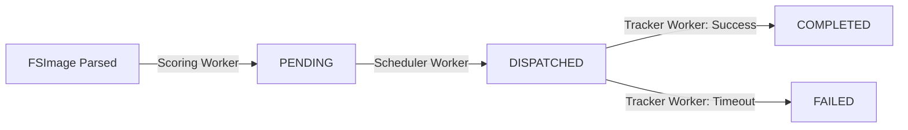

# HDFS Auto-Tiering Service (DSC)

HDFS의 NameNode 메타데이터(FSImage)를 분석하여 파일의 접근 빈도 및 크기에 따라 데이터를 HOT(SSD), WARM(DISK), COLD(ARCHIVE) 스토리지로 자동 재배치(Tiering)하는 클라우드 네이티브 데몬입니다.

---

## 📌 아키텍처 개요 (Architecture Highlights)

본 서비스는 외부 Python 스크립트나 별도 크론(Cron) 스케줄러에 의존하지 않는 **"All-in-Java Single JAR"** 아키텍처를 채택하고 있습니다. 

YARN Service Framework를 통해 단일 JVM 컨테이너로 기동되며, 하나의 프로세스 내부에서 3개의 독립적인 비동기 워커(Worker) 스레드가 역할을 분담하여 완벽하게 구동됩니다.

### 3-Worker 모델

1. **Scoring Worker (Producer)**
   - **역할**: 매일 자정 등 주기적으로 실행되어 이동할 파일을 선별합니다.
   - **작동 원리**: Java 내부의 `DFSAdmin.fetchImage` API를 호출하여 NameNode로부터 최신 FSImage를 원격(HTTP)으로 받아옵니다. 이후 내장된 `OfflineImageViewerPB`를 통해 메타데이터를 파싱하고, 우선순위 계산 후 결과를 PostgreSQL에 `PENDING` 상태로 일괄(Batch) 삽입합니다.
   
2. **Scheduler Worker (Dispatcher & Feedback Loop)**
   - **역할**: JMX 메트릭 피드백 루프를 통해 클러스터의 부하 상태를 모니터링하며 최적의 속도로 이동 명령을 하달합니다.
   - **작동 원리**: 단순한 주기적 폴링이 아니라, NameNode의 **JMX API(`http://<nn>:9870/jmx`)**를 호출하여 External SPS의 대기열(Queue Length)과 처리량(Throughput)을 실시간으로 확인합니다. 대기열이 포화 상태이면 스케줄링을 일시 정지(Backoff)하고, 여유가 생기면 `SELECT FOR UPDATE SKIP LOCKED`로 DB 작업을 선점하여 명령을 밀어넣는 **동적 피드백 루프(Dynamic Feedback Loop)** 체계로 동작합니다.

3. **Tracker Worker (Consumer / Verifier)**
   - **역할**: NameNode의 글로벌 Lock 경합을 원천 차단하기 위해, 전수 조사가 아닌 **'JMX 모니터링 추론' 및 '주기적 샘플링'**으로 물리적 이동 완료를 검증합니다.
   - **작동 원리**: 수만 개의 파일을 일일이 `getFileBlockLocations` API로 검사하면 NameNode에 극심한 Read Lock 병목이 발생합니다. 이를 방지하기 위해 JMX의 블록 이동 지표(`blocksMoved`)와 큐 상태를 관찰하여 배치 작업의 완료 타이밍을 1차 추론합니다. 이후 전체 작업 중 **극히 일부(예: 1~5%)만 샘플링**하여 블록 물리 위치를 교차 검증하고, 검증 통과 시 해당 배치를 일괄 `COMPLETED`로 처리하는 고도화된 기법을 사용합니다.

---

## 🗄 데이터베이스 상태 전이도 (State Machine)

모든 파일 이동 작업은 PostgreSQL `pending_jobs` 테이블 상에서 엄격한 생명주기를 가집니다.



- 각 Worker는 본인에게 할당된 역할(INSERT, DISPATCH, COMPLETE)만 수행하므로 **데드락(Deadlock)이나 Race Condition이 발생하지 않는 견고한 동시성 모델**을 보장합니다.

---

## 📂 패키지 구조 가이드 (Implementation Guide)

코드 구현 시 팀원 간 동일한 멘탈 모델을 유지하기 위해 핵심 비즈니스 로직을 아래와 같이 패키징합니다.

```text
edu.dsc.tiering
├── Main.java                 # 공유 자원(DB, HDFS) 초기화 및 3대 Worker 스레드풀 기동
├── config/                   # application.yaml 파싱 및 로딩
├── hdfs/
│   ├── HdfsApiCaller.java    # 스토리지 정책 변경 및 SPS 호출 로직
│   └── FsImageFetcher.java   # DFSAdmin.fetchImage 및 OIV 파싱 래퍼 클래스
├── model/                    # 도메인 모델 (Tier, JobStatus, PendingJob 등)
├── repository/               
│   └── PendingJobRepository  # HikariCP 기반 JDBC CRUD (SKIP LOCKED 구현)
├── scoring/
│   ├── ScoringEngine.java    # FSImage 메타데이터 분석 스레드
│   └── PriorityRule.java     # 접근 시간, 파일 크기에 따른 가중치 알고리즘
├── scheduler/
│   └── BatchScheduler.java   # PENDING -> DISPATCHED 스레드
└── tracking/
    └── CompletionTracker.java# DISPATCHED -> COMPLETED 검증 스레드
```

---

## ⚙️ 설정 및 인터페이스 (Configuration)

모든 동작 주기, 가중치, 타임아웃 등은 통합된 하나의 `yaml` 파일을 통해 제어됩니다.

```yaml
workers:
  scoring:
    cron: "0 0 0 * * ?"
    weight-access-time: 0.7
    weight-file-size: 0.3
  scheduler:
    poll-interval-seconds: 10
    concurrency: 8
  tracker:
    poll-interval-seconds: 30
    timeout-hours: 12
```

---

## 🚀 Quick Start

로컬 Windows 11 + WSL2 환경에서의 전체 인프라 구성(NameNode, DataNode 3대, External SPS, PostgreSQL 등) 및 YARN Service 배포 방법은 **INFRA.md** 문서를 참고하세요.
