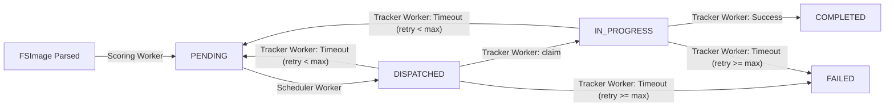

# HDFS Auto-Tiering Service (DSC)

HDFS의 NameNode 메타데이터(FSImage)를 분석하여 파일의 접근 빈도 및 크기에 따라 데이터를 HOT(ALL_SSD), WARM(ONE_SSD), COLD(COLD/ARCHIVE) 스토리지 정책으로 자동 재배치하는 오토티어링 서비스입니다.

---

## 아키텍처 개요

본 서비스는 Java 단일 JAR로 패키징되어 YARN의 서비스 프레임워크으로 배포할 수 있도록 설계되었습니다. 하나의 프로세스 내부에서 세 가지 역할인 Scoring, Scheduling, Tracking을 수행합니다.

### 구성

1. Scoring (`ScoringEngine`)
    - 역할: `FsImageFetcher`로 FSImage를 다운로드·OIV 파싱한 뒤, `PriorityRule`로 목표 티어와 우선순위를 계산하여 `PendingJobRepository.insertPendingJobs`로 `pending_jobs`에 PENDING 행을 삽입합니다.
    - 구현 참조: [hdfs-auto-tiering/src/main/java/edu/dsc/tiering/hdfs/FsImageFetcher.java](hdfs-auto-tiering/src/main/java/edu/dsc/tiering/hdfs/FsImageFetcher.java), [hdfs-auto-tiering/src/main/java/edu/dsc/tiering/scoring/ScoringEngine.java](hdfs-auto-tiering/src/main/java/edu/dsc/tiering/scoring/ScoringEngine.java)

2. Scheduling (`BatchScheduler`)
    - 역할: `PendingJobRepository.claimBatch`로 우선순위 상위 PENDING을 원자적으로 점유해 상태를 `DISPATCHED`로 변경하고, 각 job에 대해 `HdfsApiCaller.applyTier`를 호출해 HDFS에 storage policy를 적용합니다. HDFS 호출 실패는 `PendingJobRepository.recordHdfsFailure`로 처리됩니다.
    - 구현 참조: [hdfs-auto-tiering/src/main/java/edu/dsc/tiering/scheduler/BatchScheduler.java](hdfs-auto-tiering/src/main/java/edu/dsc/tiering/scheduler/BatchScheduler.java), [hdfs-auto-tiering/src/main/java/edu/dsc/tiering/repository/PendingJobRepository.java](hdfs-auto-tiering/src/main/java/edu/dsc/tiering/repository/PendingJobRepository.java)

3. Tracking (`CompletionTracker`)
    - 역할: `PendingJobRepository.claimTrackableBatch`로 DISPATCHED/IN_PROGRESS 작업을 점유해 `IN_PROGRESS`로 전이한 뒤, `HdfsPolicyChecker.isSatisfied`를 병렬로 호출해 완료 여부를 검증합니다. 성공 시 `markCompleted`, 타임아웃/영구 실패 시 `markFailed` 또는 `markFailedPermanently`를 호출합니다.
    - 구현 참조: [hdfs-auto-tiering/src/main/java/edu/dsc/tiering/tracking/CompletionTracker.java](hdfs-auto-tiering/src/main/java/edu/dsc/tiering/tracking/CompletionTracker.java), [hdfs-auto-tiering/src/main/java/edu/dsc/tiering/hdfs/HdfsPolicyChecker.java](hdfs-auto-tiering/src/main/java/edu/dsc/tiering/hdfs/HdfsPolicyChecker.java)

---

## 🗄 데이터베이스 상태 전이도

모든 파일 이동 작업은 PostgreSQL의 `pending_jobs` 테이블에서 다음과 같은 상태 전이를 따릅니다.



---

## 📂 패키지 구조 가이드

프로젝트 주요 패키지와 역할은 다음과 같습니다.

```text
edu.dsc.tiering
├── Main.java                 # 공유 자원(DB, HDFS) 초기화 및 워커 기동
├── config/                   # application.yaml 파싱 및 로딩
├── hdfs/
│   ├── HdfsApiCaller.java    # 스토리지 정책 적용 및 SPS 연동
│   └── FsImageFetcher.java   # FSImage 수집 및 OIV 파싱 래퍼
├── model/                    # 도메인 모델 (Tier, JobStatus, PendingJob 등)
├── repository/               # DB 접근(예: PendingJobRepository)
├── scoring/                  # ScoringEngine, PriorityRule
├── scheduler/                # BatchScheduler, WindowSelector
└── tracking/                 # CompletionTracker, HdfsPolicyChecker
```

---

## ⚙️ 설정

모든 주기, 가중치, 타임아웃 등은 `application.yaml`에서 설정합니다.

```yaml
scoring:
    enabled: true
    interval-seconds: 86400
    weight-access-time: 0.5
    weight-file-size: 0.5
    local-fsimage-dir: /tmp/hdfs-auto-tiering-fsimage
    target-directories:
        - /test/metric

scheduler:
    poll-interval-seconds: 10
    concurrency: 8

tracker:
    poll-interval-seconds: 45
    timeout-minutes: 60
    completion-ratio: 0.95
```

기본 설정 파일: [hdfs-auto-tiering/src/main/resources/application.yaml](hdfs-auto-tiering/src/main/resources/application.yaml)

---

## 동작 개요

1. Scoring: `FsImageFetcher`가 FSImage를 수집·파싱하면 `ScoringEngine`이 화이트리스트(`scoring.target-directories`) 기준으로 스코어링하여 `pending_jobs`에 삽입합니다.
2. Scheduling/Dispatch: `BatchScheduler`가 `claimBatch`로 PENDING 작업을 점유(SELECT ... FOR UPDATE SKIP LOCKED)해 DISPATCHED로 전이하고, 각 job에 대해 `HdfsApiCaller.applyTier`를 호출해 스토리지 정책을 적용합니다. 실패 시 재시도 카운트를 증가시키고 상태를 조정합니다.
3. Tracking: `CompletionTracker`가 DISPATCHED/IN_PROGRESS 작업을 점유해 `HdfsPolicyChecker`로 검증하고 성공 시 COMPLETED, 실패/타임아웃 시 재시도 또는 FAILED로 처리합니다.

---

## 운영 문서

- 인프라 구성: [INFRA.md](INFRA.md)
- 배포 및 릴리즈: [DEPLOY.md](DEPLOY.md)
---

## 요구사항

- Java 11
- Maven
- PostgreSQL
- Hadoop 3.4.1